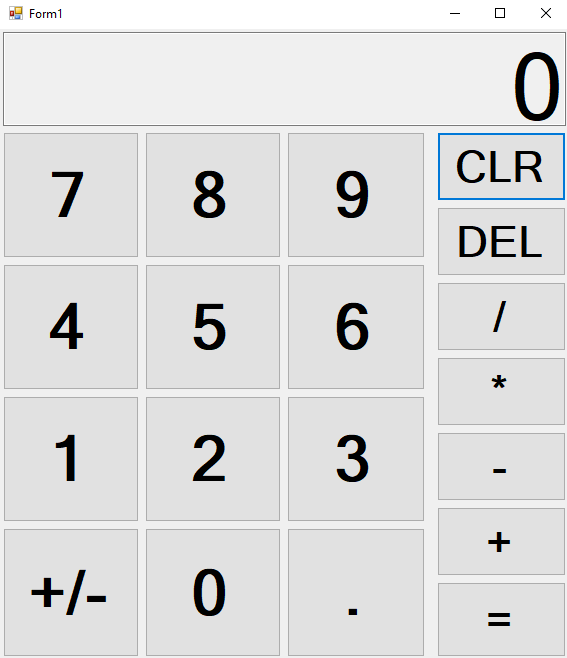

# C# Calculator App
Simple calculator app built using C# and WinForms

## Table of Contents
* [General info](#general-info)
* [Technologies](#technologies)
* [Setup](#setup)
* [Demo](#demo)
* [Known Issues](#known-issues)

## General info
This is a calculator application built using C# and WinForms to help me familiarize myself with the C# language.  The calculator is able to perform basic arithmetic operations and is modeled after the calculator application provided by the Windows OS. 

## Technologies
This project was written in C#.

## Setup
To install this project on your computer, download the code from the repository as a zip file and extract the files into a directory on your computer. 

 

To run the app, navigate to the app through CalculatorApp/bin/Debug and double-clicking on CalculatorApp.exe

## Demo 

## Known Issues
* Utilizing the negative sign button tends to have some random behaviors and displays the wrong output.
